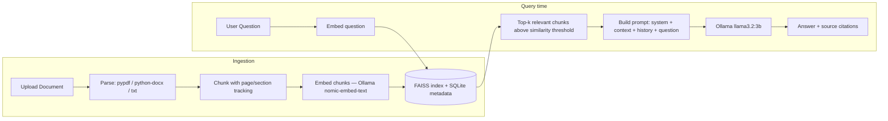

# DocuMind — RAG Document Chatbot

A Retrieval-Augmented Generation (RAG) chatbot that answers questions about your own documents. Upload PDFs, TXT, or DOCX files; the app chunks and embeds them, retrieves the most relevant passages for each question, and generates an answer grounded in that context — with source citations, using **fully local models via [Ollama](https://ollama.com)**. No API keys, no cloud calls, no data leaving your machine.

## Features

- Upload PDF / TXT / DOCX documents (drag-and-drop or click), with validation, size limits, duplicate detection, and clear processing/ready/failed states
- Multi-document knowledge base with persistent storage — survives restarts
- Chunking with page (PDF) / section (TXT, DOCX) tracking for accurate citations
- Local embeddings (`nomic-embed-text`) + local chat generation (`llama3.2:3b`) via Ollama
- Cosine-similarity retrieval over a persisted FAISS index, with a relevance threshold so the model isn't fed irrelevant context
- Grounded answers only: if the documents don't contain the answer, the assistant says so explicitly instead of guessing
- Source citations (filename + page/section) shown under each answer
- Multi-turn conversations with history, a conversation sidebar, and the ability to start/delete chats
- Document management: see status, type, chunk count, upload date; delete a document and its vectors are removed too (no orphaned embeddings)
- Clean error handling throughout — no raw stack traces reach the UI
- Modern React chat UI: welcome screen with suggested prompts, markdown rendering, copy-to-clipboard, loading states, auto-scroll

## Architecture



**Request flow:** React frontend → FastAPI backend → RAG service (retrieval + grounding) → FAISS/SQLite → Ollama (local LLM) → grounded response with citations back to the UI.

## Tech stack

| Layer | Technology |
|---|---|
| Frontend | React 19, TypeScript, Vite, Tailwind CSS v4 |
| Backend | FastAPI, Python 3.13 |
| Vector store | FAISS (`IndexIDMap2` over `IndexFlatIP`, cosine similarity, persisted to disk) |
| Metadata store | SQLite (documents, chunks, conversations, messages) |
| LLM / embeddings | Ollama — `llama3.2:3b` (chat), `nomic-embed-text` (embeddings) — fully local |
| Document parsing | `pypdf` (PDF), `python-docx` (DOCX), plain text |

## RAG workflow

1. **Upload** — file is validated (type, size, non-empty), hashed to detect duplicates, and saved.
2. **Parse** — text is extracted per page (PDF) or per paragraph (TXT/DOCX).
3. **Chunk** — the full document text is chunked with overlap (~1000 chars, 150 overlap by default); each chunk remembers which page/section it started in.
4. **Embed** — chunks are embedded locally via Ollama's `nomic-embed-text` and L2-normalized.
5. **Store** — vectors go into a FAISS index (id-mapped to SQLite chunk rows); metadata (filename, page/section, chunk text) goes into SQLite.
6. **Ask** — the latest user question is embedded and used to search FAISS (top 5, by default), filtered by a similarity threshold — this is the retrieval signal, independent of conversation history.
7. **Ground** — if no documents are indexed, or nothing clears the relevance threshold, the app returns *"I couldn't find sufficient information in the uploaded documents to answer that."* directly, without calling the LLM.
8. **Generate** — otherwise, the system prompt, numbered retrieved context, recent conversation history, and the question are sent to `llama3.2:3b`, which is instructed to answer only from the provided context.
9. **Cite** — sources (filename + page/section) are deduplicated and returned alongside the answer; the UI shows the model's own "I couldn't find..." refusal without stale sources attached.

## Prerequisites

- Python 3.11+ (3.13 recommended)
- Node.js 18+
- [Ollama](https://ollama.com) installed and running

## Installation

### 1. Install and start Ollama, pull the models

```bash
brew install ollama                 # macOS; see ollama.com for other platforms
brew services start ollama          # or: ollama serve
ollama pull llama3.2:3b
ollama pull nomic-embed-text
```

### 2. Backend

```bash
cd backend
python3 -m venv .venv
source .venv/bin/activate           # Windows: .venv\Scripts\activate
pip install -r requirements.txt
cp .env.example .env                # defaults work out of the box
uvicorn main:app --reload --port 8000
```

Verify it's healthy: `curl http://localhost:8000/api/health` should report `"status": "ok"`.

### 3. Frontend

```bash
cd frontend
npm install
npm run dev
```

Open http://localhost:5173. The dev server proxies `/api` to `http://localhost:8000` (see `vite.config.ts`), so no CORS setup is needed in development.

## Environment configuration

`backend/.env` (copied from `backend/.env.example`):

```env
OLLAMA_HOST=http://localhost:11434
CHAT_MODEL=llama3.2:3b
EMBEDDING_MODEL=nomic-embed-text

CHUNK_SIZE=1000
CHUNK_OVERLAP=150
TOP_K=5
SIMILARITY_THRESHOLD=0.4
HISTORY_TURNS=6

MAX_FILE_SIZE_MB=20
ALLOWED_ORIGINS=http://localhost:5173
```

No API keys are required anywhere — everything runs against your local Ollama server.

## Example usage

1. Start Ollama, the backend, and the frontend (above).
2. Open the app, drag `sample_docs/sample.txt` onto the sidebar uploader (or click to browse).
3. Once it shows "Ready", ask: *"What is RAG and why does it reduce hallucination?"*
4. The answer streams back grounded in the document, with a "Sources" row showing `sample.txt · Section N`.
5. Ask something unrelated (e.g. "What's the capital of France?") — the assistant will say it couldn't find that in your documents instead of guessing.

## Project structure

```
rag-document-chatbot/
├── backend/
│   ├── main.py                  # FastAPI app, CORS, lifespan, router registration
│   ├── db.py                    # sqlite3 access layer (documents, chunks, conversations, messages)
│   ├── config/settings.py       # pydantic-settings configuration
│   ├── api/                     # health, documents, chat routes
│   ├── services/
│   │   ├── document_service.py    # upload orchestration, parsing, hashing, dedup
│   │   ├── chunking.py             # page/section-aware overlapping chunker
│   │   ├── embedding_service.py    # Ollama embeddings
│   │   ├── vector_store_service.py # FAISS wrapper (add/search/remove/persist)
│   │   ├── llm_service.py          # Ollama chat completions
│   │   └── rag_service.py          # retrieval + grounding + citations
│   ├── models/schemas.py        # Pydantic request/response models
│   ├── utils/                   # validation, typed errors + FastAPI exception handlers
│   ├── storage/                 # uploads/, app.db, index.faiss (gitignored, created at runtime)
│   └── tests/                   # pytest unit tests (chunking, ingestion, grounding logic)
├── frontend/
│   └── src/
│       ├── api/client.ts          # typed fetch wrapper
│       ├── context/               # ChatContext, DocumentsContext
│       └── components/
│           ├── Sidebar/, Chat/, Message/, ChatInput/
│           ├── DocumentUploader/, DocumentManager/
│           ├── SourceCitation/, LoadingIndicator/
├── sample_docs/sample.txt       # sample document for quick testing
└── README.md
```

## Testing

```bash
cd backend
source .venv/bin/activate
pytest                              # chunking, ingestion/dedup, and grounding-threshold logic
```

Tests use a stubbed embedding function (no network calls), with an isolated tmp-dir SQLite/FAISS store per test. The full stack was also verified manually end-to-end (upload → chunk → embed → retrieve → generate → cite → delete → restart-persistence) against a real running Ollama instance.

## Troubleshooting

| Symptom | Fix |
|---|---|
| `/api/health` returns `"status": "degraded"` | Ollama isn't reachable or a model isn't pulled. Run `ollama serve` and `ollama pull llama3.2:3b` / `ollama pull nomic-embed-text`. |
| Upload fails with "Unsupported file type" | Only `.pdf`, `.txt`, `.docx` are supported. |
| Upload fails with "already been uploaded" | The file's content hash matches an existing document — delete the old one first if you want to re-index it. |
| Every answer says "I couldn't find sufficient information..." | No documents are indexed yet, or `SIMILARITY_THRESHOLD` is too high for your content — lower it in `backend/.env`. |
| Frontend can't reach the backend | Confirm `uvicorn` is running on port 8000 and the Vite proxy in `frontend/vite.config.ts` still points at it. |
| PDF produces no text / "No readable text" error | The PDF is likely scanned/image-only; OCR isn't supported. Try a text-based PDF. |

## Remaining limitations

- No OCR — scanned/image-only PDFs won't extract text.
- Retrieval uses only the latest question (by design, per the spec), so pronoun-heavy follow-ups like "summarize *that*" can retrieve weakly; rephrasing with the topic explicit works better.
- No hybrid (keyword) search or reranking — vector search only, to keep the system simple and maintainable.
- Single-user, no authentication — intended for local/personal use.
- No streaming responses — answers arrive as one complete response.
